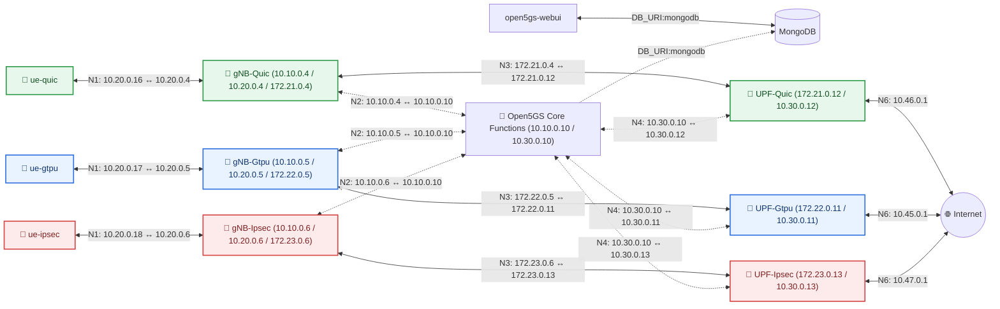

# QUICUP EVALUATION

Containerized and Cloud-Native 5G network setup with QUICUP, GTP-U with IPSec, and GTP-U using Open5GS and UERANSIM.

This project supports two execution environments:
1. **Docker Compose Setup (Local Dev):** Lightweight, single-node container deployment utilizing profiles.
2. **Kubernetes & Helm Setup (Cloud-Native):** Distributed multi-cluster orchestration using Helm, Kustomize, and Multus CNI.

---

## Features

- [x] Implement docker bridge and local profiles
- [x] Explore alternatives in 3GPP: SRv6
- [x] Implementation of QUIC protocol with msquic
- [x] Integrate QUIC tunnel into UERANSIM and Open5GS
- [x] Create parallel containers for GTP-U, GTP-U+IPsec and QUIC tunnels on separate networks
- [x] Transport mode flag for gNB and UPF
- [x] Integrate siemens/edge_shark to monitor traffic
- [x] Integrate Dozzle to monitor traffic on each container
- [x] Implement GTP-U+IPsec with AES-GCM algorithm
- [x] Implement measurement script to plot throughput, jitter, latency and packet loss
- [x] **Kubernetes Orchestration:** Deploy split control/user plane architectures using local Helm charts
- [x] **Multus CNI Integration:** Dedicated high-speed physical network interface attachment for cellular interfaces

---

## Deployment Option Comparison

| Feature | Docker Compose | Kubernetes & Helm |
| :--- | :--- | :--- |
| **Primary Use Case** | Fast config debugging & local testing | Cloud-native production simulation |
| **Networking CNI** | Docker Bridge Networks | Multus CNI (Macvlan Host Bridges) |
| **Architecture** | Single-node container group | Decoupled Multi-Cluster (Core vs RAN) |
| **Orchestration** | `docker compose up` | `helm` |

---

## Generate self-signed TLS certificate and key

```bash
mkdir -p config/secrets &&
openssl req -x509 -newkey rsa:4096 -keyout config/secrets/server.key -out config/secrets/server.crt -days 365 -nodes -subj "/CN=localhost"
```

## Deployment Option 1: Docker Compose (Local Dev)

### Prerequisites

- Linux host (for SCTP + TUN creation device support)
- Docker Engine + Docker Compose v2
- `iptables` and `iproute2` on the host

### Quick Start

1. Clone repository with submodules:
```bash
git clone https://gitlab.cs.fau.de/qa75ruzo/quicup_project.git
cd quicup_project
```

2. Create copy of `.env.example` and rename to `.env`:
```bash
cp .env.example .env
```

3. Build base image:
```bash
docker compose build base
```

4. Start one transport profile:
```bash
# QUIC 
docker compose --profile quic up -d --build

# GTP-U
docker compose --profile gtpu up -d --build

# GTP-U + IPsec
docker compose --profile ipsec up -d --build
```

5. Start all transport profiles in parallel:
```bash
docker compose --profile "*" up -d --build
```

6. Remove docker compose containers:
```bash
docker compose --profile "*" down -v --remove-orphans
```

### Access UI Elements

| Service | URL | Credentials |
|---------|-----|-------------|
| WebUI | <http://localhost:9999> | admin/1423 |
| Dozzle | <http://localhost:8080/> | - |
| EdgeShark | <http://localhost:5001/> | - |

### Connect to Internet

1. To forward packets from containers to internet, host acts as a router:
```bash
sudo sysctl -w net.ipv4.ip_forward=1
```

2. Add UE subnets to masquerade in host:
```bash
sudo iptables -t nat -I POSTROUTING -s 10.45.0.0/16 -o wlp3s0 -j MASQUERADE
sudo iptables -t nat -I POSTROUTING -s 10.46.0.0/16 -o wlp3s0 -j MASQUERADE
sudo iptables -t nat -I POSTROUTING -s 10.47.0.0/16 -o wlp3s0 -j MASQUERADE
sudo iptables -t nat -A POSTROUTING -s 10.10.0.0/16 ! -o br-open5gs -j MASQUERADE
```

3. Add docker custom bridges to iptables:
```bash
sudo iptables -I DOCKER-USER 1 -o br-gtpu -d 10.45.0.0/16 -j ACCEPT
sudo iptables -I DOCKER-USER 1 -i br-gtpu -s 10.45.0.0/16 -j ACCEPT
sudo iptables -I DOCKER-USER 1 -o br-quic -d 10.46.0.0/16 -j ACCEPT
sudo iptables -I DOCKER-USER 1 -i br-quic -s 10.46.0.0/16 -j ACCEPT
sudo iptables -I DOCKER-USER 1 -o br-ipsec -d 10.47.0.0/16 -j ACCEPT
sudo iptables -I DOCKER-USER 1 -i br-ipsec -s 10.47.0.0/16 -j ACCEPT
```

4. Routing setups:
```bash
# Routing to GTPU UPF
sudo ip route add 10.45.0.0/16 via 172.22.0.11 dev br-gtpu
sudo ip route replace 10.45.0.0/16 via 172.22.0.11 dev br-gtpu

# Routing to QUIC UPF
sudo ip route add 10.46.0.0/16 via 172.21.0.12 dev br-quic
sudo ip route replace 10.46.0.0/16 via 172.21.0.12 dev br-quic

# Routing to GTP-U IPsec UPF
sudo ip route add 10.47.0.0/16 via 172.23.0.13 dev br-ipsec
sudo ip route replace 10.47.0.0/16 via 173.23.0.13 dev br-ipsec
```

### Sanity check for ipsec
```bash
docker exec -t ueransim-gnb-gtpu-ipsec ipsec statusall
```

### Traffic control in docker
```bash
# Limit traffic on gnb
docker exec -t ueransim-gnb-quic tc qdisc add dev <quic_tunnel_logical_interface> root netem delay 25ms 5ms loss 1%
docker exec -t ueransim-gnb-gtpu tc qdisc add dev <gtpu_tunnel_logical_interface> root netem delay 25ms 5ms loss 1%
docker exec -t ueransim-gnb-gtpu-ipsec tc qdisc add dev <gtpu_ipsec_tunnel_logical_interface> root netem delay 25ms 5ms loss 1%

# Limit traffic on upf
docker exec -t open5gs-upf-quic tc qdisc add dev <quic_tunnel_logical_interface> root netem delay 25ms 5ms loss 0.1%
docker exec -t open5gs-upf-gtpu tc qdisc add dev <gtpu_tunnel_logical_interface> root netem delay 25ms 5ms loss 0.1%
docker exec -t open5gs-upf-gtpu-ipsec tc qdisc add dev <gtpu_ipsec_tunnel_logical_interface> root netem delay 25ms 5ms loss 0.1%

# Restore defaults
docker exec -t ueransim-ue-quic tc qdisc del dev <quic_tunnel_logical_interface> root
docker exec -t ueransim-ue-gtpu tc qdisc del dev <gtpu_tunnel_logical_interface> root
docker exec -t ueransim-ue-gtpu-ipsec tc qdisc del dev <gtpu_ipsec_tunnel_logical_interface> root
```

## Architecture Diagrams

### Docker Compose Topology


---

## Deployment Option 2: Kubernetes & Helm (Distributed)

For full deployment architecture details, troubleshooting notes, and multi-cluster CNI setup instructions, read the dedicated guide:
👉 **[k8s/README.md](k8s/README.md)**

### Quick Start (Manual Install)

```bash
# 1. Add Multus network attachment definitions to both clusters
helm install network k8s/charts/quicup/network 
helm install network k8s/charts/quicup/network 

# 2. Install Open5GS Core on core cluster
helm install core k8s/charts/quicup/core 

# 3. Install UERANSIM RAN on RAN cluster
helm install ran k8s/charts/quicup/ran
```

*Note: To run GTP-U or QUIC exclusively, pass `--set quic.enabled=false` or `--set gtpu.enabled=false` overrides to your `core` and `ran` Helm commands (details in the [Kubernetes Setup Guide](k8s/README.md)).*

---

## Measurements & Evaluation

> [!IMPORTANT]
> **Docker Compose Constraint:** The measurements script (`main.py`) is designed and implemented to interface directly with Docker container environments. **It works exclusively with the Docker Compose setup** and does not support benchmarking the Kubernetes/Helm multi-cluster deployments.

The project includes an automated Python evaluation script (`main.py` inside the `measurements/` directory) to benchmark latency, throughput, jitter, and packet loss across your active tunnels.

### 1. Prerequisites for Measurements
Before running the benchmark script, ensure you have:
* **Host Tooling:** `iperf3` and `ping` installed on your host OS.
* **Python Libraries:** Install the pandas, matplotlib, and numpy dependencies:
  ```bash
  pip install .
  ```
* **iperf3 Servers Running:** Ensure the iperf3 server daemons are running inside your UPF containers:
  ```bash
  # Docker Compose:
  docker exec -d open5gs-upf-gtpu iperf3 -s -B 10.45.0.1
  docker exec -d open5gs-upf-quic iperf3 -s -B 10.46.0.1
  docker exec -d open5gs-upf-gtpu-ipsec iperf3 -s -B 10.47.0.1
  ```

### 2. Running Benchmarks
Run the evaluation script to collect user-plane measurements:
```bash
python main.py -p quic gtpu -m rtt throughput jitter -dir measurements/results/
```
* **Tunnels/Profiles (`-p`):** Benchmark `quic`, `gtpu`, or `ipsec` tunnels.
* **Metrics (`-m`):** Collect `rtt` (ping), `throughput` (iperf3 TCP), or `jitter` (iperf3 UDP).
* **Output:** Raw benchmark data is stored as JSON/JSONL files under your output directory. Summarized throughput and latency comparison graphs are generated as `.png` plots in the same folder.

---

## Replicating the Evaluation (GTP-U vs. QUIC)

Follow this workflow to replicate the performance measurements of QUIC-encapsulated vs. standard GTP-U user planes:

1. **Deploy both profiles:** Start your containers (via Docker compose or Kubernetes).
2. **Launch iperf3 daemons:** Start the listening servers inside your UPF pods/containers.
3. **Execute Benchmark Script:** Run the measurement suite to perform pings and active TCP throughput evaluations.
4. **Apply Traffic Control (TC) Constraints:** Add network constraints to simulate real-world cellular packet loss/latency:
   ```bash
   # Add 25ms delay and 1% loss to GTP-U gNB interface
   docker exec -t ueransim-gnb-gtpu tc qdisc add dev eth0 root netem delay 25ms loss 1%
   # Add 25ms delay and 1% loss to QUIC gNB interface
   docker exec -t ueransim-gnb-quic tc qdisc add dev eth0 root netem delay 25ms loss 1%
   ```
5. **Re-Run Benchmarks:** Execute the python script again and compare the resulting graphs in the `measurements/results/` folder to see how the QUIC datagram retransmission/security protocols behave under loss compared to raw GTP-U.
6. **Teardown Constraints:** Remove the netem qdiscs:
   ```bash
   docker exec -t ueransim-gnb-gtpu tc qdisc del dev eth0 root
   docker exec -t ueransim-gnb-quic tc qdisc del dev eth0 root
   ```

---

## References & Publications

This project is built upon and references the following standards, research, and open-source projects:

### Standards & Protocols
*   **[3GPP TS 29.281](https://www.3gpp.org/DynaReport/29281.htm)** — GPRS Tunnelling Protocol User Plane (GTPv1-U).
*   **[RFC 9000](https://www.rfc-editor.org/rfc/rfc9000.html)** — QUIC: A UDP-Based Multiplexed and Secure Transport.
*   **[RFC 9221](https://www.rfc-editor.org/rfc/rfc9221.html)** — An Unreliable Datagram Extension to QUIC.

### Open Source Frameworks
*   **[Open5GS](https://open5gs.org/open5gs/docs/)** — Open-source implementation for 5G Core and EPC.
*   **[UERANSIM](https://github.com/aligungr/ueransim)** — Open-source 5G UE and gNB (NR) simulator.
*   **[MsQuic](https://github.com/microsoft/msquic)** — Microsoft's implementation of the IETF QUIC protocol.
*   **[strongSwan](https://www.strongswan.org/)** — IPsec-based VPN solution for Linux.

### Research & Publications
*   **QUICUP Citation:** Wernet, L., et al. (2025). *QUICUP: Secure User Plane Tunneling for Cellular Networks*. Proc. of the 50th Annual IEEE Conference on Local Computer Networks (LCN). [DOI: 10.1109/LCN65610.2025.11146319](https://doi.org/10.1109/LCN65610.2025.11146319)
