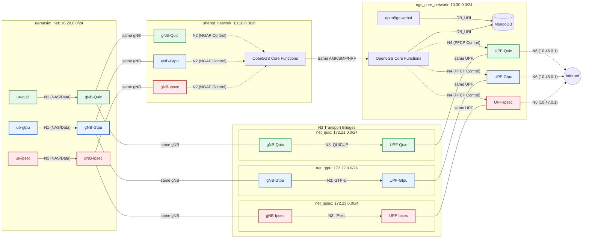

# QUICUP PROJECT

Containerized 5G network setup with QUICUP, GTP-U with IPSec and GTP-U using Open5GS and UERANSIM.

## Features

- [x] Implement docker bridge
- [x] Explore few alternatives in 3GPP: SRv6
- [x] implementation of quic protocol with msquic
- [x] integrate quic tunnel into ueransim and open5gs
- [x] Create parallel containers for gtpu, gtpu-IPsec and quic tunnels on separate networks
- [x] Transport mode flag for gnb and upf
- [x] Integrate siemens/edge_shark to monitor traffic
- [x] Integrate Dozzle to monitor traffic on each container
- [x] Implement gtpu-IPSec with acs-gcm algorithm.
- [x] Implement measurement script to plot throughput, jitter, latency and packet loss.
- [x] Implement docker profiles to start specific tunnel needed


## Prerequisites

- Linux host (for SCTP + TUN creation device support)
- Docker Engine + Docker Compose v2
- `iptables` and `iproute2` on the host

## Installation

### 1. Clone with submodules

```bash
openssl req -x509 -newkey rsa:4096 -keyout server.key -out server.crt -days 365 -nodes -subj "/CN=localhost"
```

## Quick Start

1. Clone repository with submodules:

```bash
git clone https://gitlab.cs.fau.de/qa75ruzo/quicup_project.git
cd quicup_project
```

1. Build base image:

```bash
docker compose build base
```

3. Start one transport profile

```bash
# QUIC 
docker compose --profile quic up -d --build

# GTP-U
docker compose --profile gtpu up -d --build

# GTP-U + IPsec
docker compose --profile ipsec up -d --build
```

4. Start all transport profiles in parallel

```bash
docker compose --profile "*" up -d --build
```

5. Remove docker compose containers

```bash
docker compose --profile "*" down -v --remove-orphans
```

### Access UI Elements

| Service | URL | Credentials |
|---------|-----|-------------|
| WebUI | <http://localhost:9999> | admin/1423 |
| Dozzle | <http://localhost:8080/> | - |
| EdgeShark | <http://localhost:5001/> | - |


## Connect to Internet

1. To forward packets from containers to internet, host acts as a router (resets to 0 on every reboot)

```bash
sudo sysctl -w net.ipv4.ip_forward=1
```

2. Add UE subnet 10.45.0.0/16 to masquerade in host. So, the traffic from ueransim-UE uses wlan0/eth0 address. CHeck this thoroughly.

```bash
sudo iptables -t nat -I POSTROUTING -s 10.45.0.0/16 -o wlp3s0 -j MASQUERADE
sudo iptables -t nat -I POSTROUTING -s 10.46.0.0/16 -o wlp3s0 -j MASQUERADE
sudo iptables -t nat -I POSTROUTING -s 10.47.0.0/16 -o wlp3s0 -j MASQUERADE
sudo iptables -t nat -A POSTROUTING -s 10.10.0.0/16 ! -o br-open5gs -j MASQUERADE
```

### Metrics (`-m`)

```bash
  sudo iptables -t nat -A POSTROUTING -s 10.10.0.0/16 ! -o br-open5gs -j MASQUERADE
```

3. Add docker custom bridge br-open5gs to iptables for incoming and outgoing to allow traffic to internet from network


```bash
sudo iptables -I DOCKER-USER 1 -o br-gtpu -d 10.45.0.0/16 -j ACCEPT
sudo iptables -I DOCKER-USER 1 -i br-gtpu -s 10.45.0.0/16 -j ACCEPT
sudo iptables -I DOCKER-USER 1 -o br-quic -d 10.46.0.0/16 -j ACCEPT
sudo iptables -I DOCKER-USER 1 -i br-quic -s 10.46.0.0/16 -j ACCEPT
sudo iptables -I DOCKER-USER 1 -o br-ipsec -d 10.47.0.0/16 -j ACCEPT
sudo iptables -I DOCKER-USER 1 -i br-ipsec -s 10.47.0.0/16 -j ACCEPT
```

4. Routing to GTPU UPF

```bash
sudo ip route add 10.45.0.0/16 via 172.22.0.11 dev br-gtpu
sudo ip route replace 10.45.0.0/16 via 172.22.0.11 dev br-gtpu
```

5. Routing to QUIC UPF

```bash
sudo ip route add 10.46.0.0/16 via 172.21.0.12 dev br-quic
sudo ip route replace 10.46.0.0/16 via 172.21.0.12 dev br-quic
```

6. Routing to GTP-U IPsec UPF

```bash
sudo ip route add 10.47.0.0/16 via 172.23.0.13 dev br-ipsec
sudo ip route replace 10.47.0.0/16 via 173.23.0.13 dev br-ipsec
```

## Sanity check for ipsec


```bash
docker exec -t ueransim-gnb-gtpu-ipsec ipsec statusall  -- check for Established in security section
```

## Traffic control in docker

1. Limit traffic on gnb

```bash
docker exec -t ueransim-gnb-quic tc qdisc add dev <quic_tunnel_logical_interface> root netem delay 25ms 5ms loss 1%
docker exec -t ueransim-gnb-gtpu tc qdisc add dev <gtpu_tunnel_logical_interface> root netem delay 25ms 5ms loss 1%
docker exec -t ueransim-gnb-gtpu-ipsec tc qdisc add dev <gtpu_ipsec_tunnel_logical_interface> root netem delay 25ms 5ms loss 1%
```

2. Limit traffic on upf

```bash
docker exec -t open5gs-upf-quic tc qdisc add dev <quic_tunnel_logical_interface> root netem delay 25ms 5ms loss 0.1%
docker exec -t open5gs-upf-gtpu tc qdisc add dev <gtpu_tunnel_logical_interface> root netem delay 25ms 5ms loss 0.1%
docker exec -t open5gs-upf-gtpu-ipsec tc qdisc add dev <gtpu_ipsec_tunnel_logical_interface> root netem delay 25ms 5ms loss 0.1%
```


2. Restore defaults

```bash
docker exec -t ueransim-ue-quic tc qdisc del dev <quic_tunnel_logical_interface> root
docker exec -t ueransim-ue-gtpu tc qdisc del dev <gtpu_tunnel_logical_interface> root
docker exec -t ueransim-ue-gtpu-ipsec tc qdisc del dev <gtpu_ipsec_tunnel_logical_interface> root
```

## Measurements

1. Install python dependencies

```bash
pip install .
```

2. Inside measurements and run measurements script

```bash
python main.py [-h] [-p PROFILE [PROFILE ...]] [-m METRIC [METRIC ...]] [-dir DIRECTORY] [-input FILE]
               [-pc N] [--iperf-duration SEC]

5G User-Plane Measurements QUIC vs GTP-U vs GTP-U+IPsec

options:
  -h, --help            show this help message and exit
  -p, --profile PROFILE [PROFILE ...]
                        Profiles to run (default: all). Choices: quic, gtpu,
                        ipsec.
  -m, --metrics METRIC [METRIC ...]
                        Metrics to measure (default: all). Choices: rtt,
                        throughput, jitter.
  -dir, --dir DIRECTORY Directory to read/write measurement data (default: measurements/)
  -input, --input FILE  Input file with precomputed results (e.g., iperf3 jsonl)
  -pc, --ping-count N   Number of ping packets per profile (default: 30).
  --iperf-duration SEC  Duration of each iperf3 test in seconds (default:
                        100).
```

### iperf3 helper commands

Note: per the architecture each UPF advertises an N6 address reachable via the ogstun/external network. The canonical N6 addresses used in this README are:

- UPF-Quic: 10.46.0.1
- UPF-Gtpu: 10.45.0.1
- UPF-Ipsec: 10.47.0.1

If your deployment uses different ogstun or N6 addresses, replace the IPs below accordingly. Run these commands to start iperf3 servers inside the UPF and UE containers (useful for measurements):

```bash
docker exec -d open5gs-upf-gtpu-ipsec iperf3 -s -B 10.47.0.1
docker exec -d open5gs-upf-quic iperf3 -s -B 10.46.0.1
docker exec -d open5gs-upf-gtpu iperf3 -s -B 10.45.0.1

docker exec -d ueransim-ue-quic iperf3 -s
docker exec -d ueransim-ue-gtpu iperf3 -s
docker exec -d ueransim-ue-gtpu-ipsec iperf3 -s

# Stop iperf3 on UEs
docker exec -d ueransim-ue-quic pkill iperf3
docker exec -d ueransim-ue-gtpu pkill iperf3
docker exec -d ueransim-ue-gtpu-ipsec pkill iperf3

# Stop iperf3 on UPFs
docker exec -d open5gs-upf-gtpu-ipsec pkill iperf3
docker exec -d open5gs-upf-quic pkill iperf3
docker exec -d open5gs-upf-gtpu pkill iperf3
```

## Architecture

### Docker Topology Diagram

The following Mermaid diagram shows the container and network topology used by the project. The original source is available at `docs/mermaid/docker_topology_architecture.mmd`.



Source file: [docs/mermaid/docker_topology_architecture.mmd](docs/mermaid/docker_topology_architecture.mmd)

## References

- [MSQUIC GitHub](https://github.com/microsoft/msquic)
- [QUIC RFC 9000](https://www.rfc-editor.org/rfc/rfc9000.html)
- [3GPP TS 29.281 — GTP-U Protocol](https://www.3gpp.org/DynaReport/29281.htm)
- [Open5GS Documentation](https://open5gs.org/open5gs/docs/)
- [StrongSwan — IPsec for Linux](https://www.strongswan.org/)
