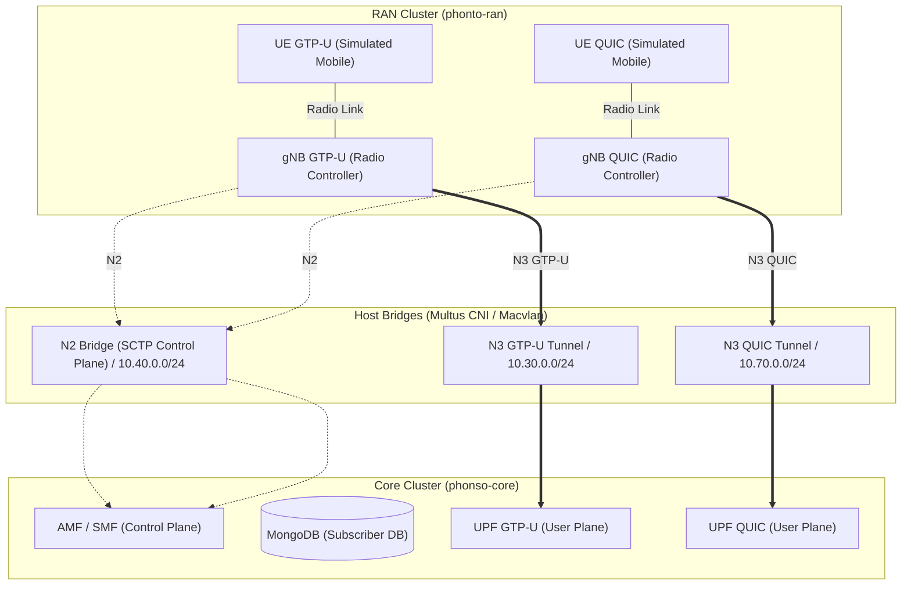

# Kubernetes & Helm Deployment Guide (Distributed 5G Simulation)

This document provides a detailed walkthrough for deploying, managing, and troubleshooting the decoupled **Open5GS Core** and **UERANSIM RAN** network inside Kubernetes.

---

## 🏗️ Architecture Design

The Kubernetes deployment simulates a distributed 5G network by splitting the core and radio nodes across two separate **Kind (Kubernetes-in-Docker)** clusters. Communication between clusters is bridged at the host network layer using **Multus CNI** with **macvlan** plugins.



---

## 🚀 Deployment Steps

### 1. Host Prerequisites
Ensure CNI plugins (specifically `macvlan`) are installed on your Fedora/Ubuntu host:
* **Fedora:** `sudo dnf install kubernetes-cni`
* **Ubuntu/Debian:** `sudo apt install kubernetes-cni`

### 2. Provision Kind Clusters
Spin up the two separate clusters. They use mapping to mount the host's `/usr/libexec/cni/` path to the container runtimes inside the nodes:
```bash
# Create the Core Cluster
kind create cluster --config k8s/infra/core-cluster.yaml --name phonso-core

# Create the RAN Cluster
kind create cluster --config k8s/infra/ran-cluster.yaml --name phonto-ran
```

### 3. Generate TLS Certificates for Core Chart
Before deploying the Open5GS Core, you must generate the self-signed certificates and store them inside the `core` chart directory. If you do not do this, the Helm installation will crash because it cannot find the certificate files.
```bash
# 1. Create the secrets directory inside the core chart
mkdir -p k8s/charts/quicup/core/secrets

# 2. Generate the key and certificate
openssl req -x509 -newkey rsa:4096 -keyout k8s/charts/quicup/core/secrets/server.key -out k8s/charts/quicup/core/secrets/server.crt -days 365 -nodes -subj "/CN=localhost"
```

### 4. Deploy Network Attachment Definitions (Nads)
Deploy the Multus CNI network configurations on **both** clusters:
```bash
helm install network k8s/charts/quicup/network --context kind-phonso-core
helm install network k8s/charts/quicup/network --context kind-phonto-ran
```

### 5. Deploy Open5GS Core
Install MongoDB, AMF, SMF, and the UPFs on the Core cluster:
```bash
helm install core k8s/charts/quicup/core --context kind-phonso-core
```
*Note: Wait about 15-30 seconds for the MongoDB database and services to fully initialize.*

### 6. Deploy UERANSIM RAN
Install the gNodeB and UE simulators on the RAN cluster:
```bash
helm install ran k8s/charts/quicup/ran --context kind-phonto-ran
```

### 7. Enable Public Internet (N6) Routing (Required for Internet access)
By default, traffic reaching the UPF's virtual `ogstun` interface cannot reach the public internet because the outer pod network doesn't route the UE private subnets. You must enable NAT (masquerading) inside the UPF containers:
```bash
# Enable NAT inside the GTP-U UPF pod
kubectl exec -it $(kubectl get pods --context kind-phonso-core -l app=open5gs-upf-gtpu -o jsonpath='{.items[0].metadata.name}') --context kind-phonso-core -- iptables -t nat -A POSTROUTING -s 10.45.0.0/16 -o eth0 -j MASQUERADE

# Enable NAT inside the QUIC UPF pod
kubectl exec -it $(kubectl get pods --context kind-phonso-core -l app=open5gs-upf-quic -o jsonpath='{.items[0].metadata.name}') --context kind-phonso-core -- iptables -t nat -A POSTROUTING -s 10.46.0.0/16 -o eth0 -j MASQUERADE
```

### 8. Deployment Profile Options (GTP-U or QUIC Only)
By default, the core and RAN charts deploy both GTP-U and QUIC tunnels in parallel. You can disable one of them using Helm values overrides:

* **To run GTP-U only:**
  ```bash
  helm install core k8s/charts/quicup/core --set quic.enabled=false --context kind-phonso-core
  helm install ran k8s/charts/quicup/ran --set quic.enabled=false --context kind-phonto-ran
  ```

* **To run QUIC only:**
  ```bash
  helm install core k8s/charts/quicup/core --set gtpu.enabled=false --context kind-phonso-core
  helm install ran k8s/charts/quicup/ran --set gtpu.enabled=false --context kind-phonto-ran
  ```

---

## 🔍 Verification & Testing

### 1. Check Pod Health
Ensure all pods in both clusters are healthy and in the `Running` state:
```bash
# Core Cluster
kubectl get pods --context kind-phonso-core

# RAN Cluster
kubectl get pods --context kind-phonto-ran
```

### 2. Confirm UE Tunnel Interface
Exec into the GTP-U UE pod to verify that the virtual tunnel interface (`uesimtun0`) is active and has been assigned an IP address by the Core network:
```bash
# Find the UE pod name on the RAN cluster
kubectl get pods --context kind-phonto-ran | grep ue-gtpu

# Inspect IP addresses
kubectl exec -it <ue-gtpu-pod-name> --context kind-phonto-ran -- ip addr
```
You should see:
```text
4: uesimtun0: <POINTOPOINT,UP,LOWER_UP> mtu 1400 state UNKNOWN
    inet 10.45.0.5/24 scope global uesimtun0
```

### 3. Test End-to-End User Plane Ping
Ping the UPF gateway interface (`10.45.0.1`) through the virtual tunnel to verify routing:
```bash
kubectl exec -it <ue-gtpu-pod-name> --context kind-phonto-ran -- ping -c 5 -I uesimtun0 10.45.0.1
```

---

## 🔄 Managing Deployments (Upgrade & Uninstall)

To manage the lifecycle of your Helm deployments, use the following commands:

### 1. Upgrading Charts (Applying Changes)
If you modify your template manifests or `values.yaml` files, you can perform an in-place upgrade. Using the `--install` flag is recommended as a best practice because it automatically installs the chart if it does not already exist:
```bash
# Upgrade/Install Network
helm upgrade --install network k8s/charts/quicup/network --context kind-phonso-core
helm upgrade --install network k8s/charts/quicup/network --context kind-phonto-ran

# Upgrade/Install Core
helm upgrade --install core k8s/charts/quicup/core --context kind-phonso-core

# Upgrade/Install RAN
helm upgrade --install ran k8s/charts/quicup/ran --context kind-phonto-ran
```

### 2. Uninstalling Charts (Teardown)
To completely delete the deployed pods, services, secrets, and CNI configurations from your clusters:
```bash
# Uninstall RAN components
helm uninstall ran --context kind-phonto-ran

# Uninstall Core components
helm uninstall core --context kind-phonso-core

# Uninstall Network attachment definitions
helm uninstall network --context kind-phonso-core
helm uninstall network --context kind-phonto-ran
```

---

## 🛠️ Troubleshooting & Technical Insights

During development and testing, several subtle issues were encountered and resolved. These are documented below for cloud-native research reference:

### A. Go Template Syntax & Formatters
* **The Problem:** Auto-formatters (such as Prettier in VS Code) often try to format double curly braces `{{ ... }}` in Helm templates as standard YAML, automatically inserting spaces like `{ { ... } }`. This crashes the Go templating engine.
* **The Workaround:** Always wrap image references and variables in double quotes, which tells the formatter to skip the line:
  ```yaml
  image: "{{ .Values.images.open5gs_core }}"
  ```

### B. Go Dot-Notation Variable Constraints
* **The Problem:** Direct dot-notation access to keys containing hyphens (e.g. `.Values.images.open5gs-core`) fails with `bad character U+002D '-'` because Go parses the hyphen as a subtraction operation.
* **The Workaround:** Replace hyphens with underscores in `values.yaml` (e.g. `open5gs_core`) or access them using the `index` function:
  ```yaml
  {{ index .Values.images "open5gs-core" }}
  ```

### C. PFCP Restoration Heartbeat Warnings
* **The Problem:** If you perform a rolling update or rollout restart of the `open5gs-core` control plane, the UPF logs will temporarily show duplicate warnings and `Invalid Recovery Time Stamp` errors.
* **The Explanation:** This is normal 3GPP PFCP restoration protocol behavior. The SMF's recovery timestamp changes when it boots back up. The UPF automatically detects this, cleans up the old stale sessions, and re-associated. Once settled, traffic resumes automatically.

### D. Rollout Race Conditions & State Mismatches
* **The Problem:** Performing a rollout restart of the gNB while keeping the UE running can cause the UE to get stuck in an idle loop (`Discarding RRC Setup Request, UE context already exists`).
* **The Explanation:** During rolling updates, the old gNB pod and new gNB pod run concurrently. The UE connects to the new gNB, but when the old gNB finally terminates, the UE triggers a `Radio link failure` and transitions to `CM-IDLE`. The new gNB is unaware of this and keeps the UE in `CONNECTED` state, causing a state mismatch that rejects new setup requests.
* **The Solution:** Always restart the UE pod after a gNB rollout is complete to establish a clean, single connection state:
  ```bash
  kubectl rollout restart deployment/ueransim-ue-gtpu --context kind-phonto-ran
  ```
